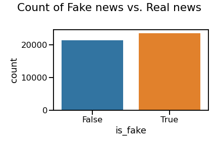
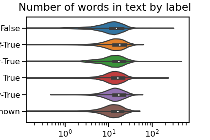
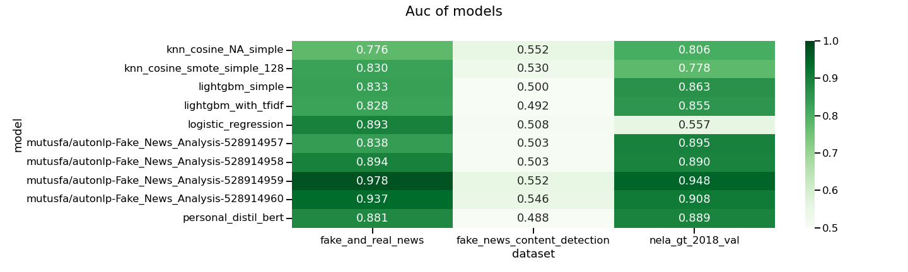
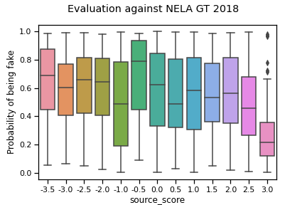
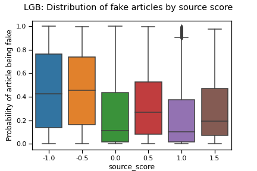

# Fake News Classification

This my capstone for Turing College deep learning course. I'm trying to build a classifier that can distinguish fake news from real news.

## Table of contents

- [Fake News Classification](#fake-news-classification)
  - [Table of contents](#table-of-contents)
  - [What is fake news?](#what-is-fake-news)
  - [Data description](#data-description)
    - [Fake and real news dataset](#fake-and-real-news-dataset)
      - [Dataset generalization](#dataset-generalization)
    - [NELA GT 2018 dataset](#nela-gt-2018-dataset)
      - [Problems with labels](#problems-with-labels)
      - [Problems with text](#problems-with-text)
      - [Dataset generalization](#dataset-generalization-1)
      - [Splits](#splits)
    - [Fake News Content Detection dataset](#fake-news-content-detection-dataset)
      - [Labels distribution](#labels-distribution)
      - [Dataset generalization](#dataset-generalization-2)
  - [Modeling](#modeling)
    - [Comparing all models](#comparing-all-models)
    - [Human performance](#human-performance)
    - [Classical models](#classical-models)
      - [Linear models](#linear-models)
      - [Gradient boosted trees (lightgbm implementation)](#gradient-boosted-trees-lightgbm-implementation)
      - [K nearest neighbors](#k-nearest-neighbors)
    - [Deep learning models](#deep-learning-models)
      - [AutoNLP from Huggingface](#autonlp-from-huggingface)
      - [DistilBERT](#distilbert)
  - [Conlusion](#conlusion)

## What is fake news?

In this work I'll use [wikipedia's definition](https://en.wikipedia.org/wiki/Fake_news) of "fake news"

> Fake news is false or misleading information presented as news.

## Data description

### Fake and real news dataset

We were suggested to use fake and real news dataset [from Kaggle](https://www.kaggle.com/c/fake-news-detection). You can check my investigation of it [here](notebooks/eda.ipynb).

Sometimes I refer to this dataset as "original dataset" in code and in this document.

Here I'll present TL;DR version.  
Dataset consists of scraped Reuters news articles, threads from Twitter and articles from Breitbart. In total there is almost 45k articles, each labeled as either fake or real. Labels are approximately balanced.  

Each article has the following features:  
* title
* body
* subject
* date of scraping
* label (labelled as True news or Fake news)

Given subjects don't overlap between labels and I decided to not try to use them - in the wild it's unlikely I'll get neat "this is what this article is talking about" feature.

Most of the articles are between 100 and 1000 words long. There is a spike of fake news articles with the only word "VIDEO" or "IMAGE" in the text, I'll scrub those out.

#### Dataset generalization

Main issue of this dataset is that all true news come from Reuters and I could write a simple rule to distinguish them from fake news. Just needed to check if word "Reuters" appears in text and got over 99% [accuracy](https://developers.google.com/machine-learning/crash-course/classification/accuracy).  

I scrubbed some obvious issues:
* mentions of Reuters - telltale sign of true news
* mentions of Breitbart - telltale sign of fake news
* signs of twitter - handles, hashtags - telltale sign of fake news
* mentions of some other news sources
* urls
* VIDEO/IMAGE/TWEET from title - picture or video only articles were fake news, this at least remove some signs that this is a video only article

Still I could craft simple rule to distinguish fake news from true news by counting the number of words in all caps which achieved 68% accuracy. I'll lowercase text before modelling. Regardless of my effort in cleaning the data, any model still effectively will be learning to answer "is this piece of text written by Reuters?" instead of learning to distinguish real news from fake news.

### NELA GT 2018 dataset

I looked for datasets to introduce variation in the dataset. I found [NELA GT 2018 dataset from Harvard Dataverse](https://dataverse.harvard.edu/dataset.xhtml?persistentId=doi:10.7910/DVN/ULHLCB).

You can check my investigation and cleaning of it [here](notebooks/eda-nela-gt-2018.ipynb).

It's pretty big with near 700k articles, allegedly all from 2018.  
Each article has the following features:
1. `date`: Date of article in `yyyy-mm-dd` format.
1. `source`: Source of article.
1. `name`: Title of article.
1. `content`: Clean text content of article.

#### Problems with labels
You might notice a problem - articles are not labeled as being fake news or real news. Instead there is the source of article. There is also a table where each source is evaluated by various fact checking and media lean websites. So I cannot tell if each article is fake or real news, but I can calculate a metascore of sorts, to evaluate reliability of the source. I decided to label every article according to reliability of its source.

Calculating source reliability was pretty tricky. None of the factchecking websites scored each and every source - my data for source reliability is pretty sparse. In the end I decided to use the following scorers:
* NewsGuard: score it gives
* Pew Research Center: its label if source is well-known
* Media Bias / Fact Check: its overall class, also its "least_biased", "questionable_source" and "conspiracy_pseudoscience" labels
* Polifact: number of times it verified source as telling truth and number of times it caught source lying

I avoided using labels corresponding to media lean, even though they were pretty predictive of NewsGuard score and I personally know that most of recent fake news websites are far-right biased. Conspiracy theories being more prevalent on the (American) right is pretty recent phenomena and I think that could change. I also don't want to punish sources that report true news and lean conservative.

For model training I'll be only using articles from sources with (un)reliability above a threshold. Empirically, thresholds -2 and below for unreliable and 2 and above for reliable achieved good results. That corresponds to at least two of the above four scorers agreeing that a particular source is (un)reliable.

#### Problems with text
Some websites implement scraping protections:  
  
I'm dropping all articles containing common error codes and with less than 10 words in their body.

#### Dataset generalization
Dataset looks very USA-specific. Most of the articles are about US politics or events in US. Any models trained on this dataset might struggle to distinguish reliable sources from unreliable when looking at European sources.

All articles allegedly are from 2018, it's pretty interesting to find news about Obama's campaign though. Still, definitely no news about current situation on Ukraine-Russia border.

#### Splits
I'm splitting the dataset into train and val sets:
* 33 reliable sources in train
* 13 unreliable sources in train
* For a total of 133215+55207=188422 articles in train
* 3 reliable sources in val
* 2 unreliable sources in val
* For a total of 6090+5937=12027 articles in val

### Fake News Content Detection dataset

To test how well my models generalize I found another dataset [from kaggle](https://www.kaggle.com/anmolkumar/fake-news-content-detection).

My short investigation of it is [here](notebooks/eda-fake-news-content-detection.ipynb).

#### Labels distribution

I'm mostly interested if models can distinguish strings labelled "False" from strings labelled "True".

#### Dataset generalization

It is quite different from my previous two datasets [NELA GT 2018 dataset](#nela-gt-2018-dataset) and [fake and real news dataset](#fake-and-real-news-dataset):
* it has no titles
* pieces of text are very short: majority is just one sentence and less than 20 words.

We'll see if models can generalize to this dataset.

## Modeling

### Comparing all models

As you can see, no model performs well on Fake News Content Detection dataset, with its very short pieces of text and no titles. These models can distinguish articles.

A small note: accuracy on nela is optimistic - I selected model thresholds to maximize acuracy on nela's validation split, so there is some data leakage.

Best performing model - across all datasets! - is DistillBERT by AutoNLP, specifically `mutusfa/autonlp-Fake_News_Analysis-528914959`.

I didn't try to train a lot of deep learning models myself, since initial results took about a day to show up and I had a lot of trouble with google colab kicking me out. Now I've realized that of those 24 hours model only trained for about 4 and I'm planning to play some more. Currently my best performing model ignores up to half of the input, so I think there are still gains to be made.

### Human performance

I and one friend looked only at titles of articles and tried to predict if news are reliable or not. What can I say, on first try I got 8/20 correct (40% accuracy), on second 13/20 correct (65% accuracy). Ugnius got 55% accuracy. While this is slightly higher than random chance, I'm too lazy to do math to tell it was pure luck. It's also clear that distinguishing fake news from real news based on title alone is hard. [You can try for yourself](notebooks/julius_classifier.ipynb). Admittedly, I'm also giving models full text of the article which we weren't reading cause we didn't want to spend too much time on it.

### Classical models

My work with classical machine learning models can be found [here](notebooks/modelling.ipynb).

For all classical models I preprocesed text with [fasttext](https://fasttext.cc/), specifically their [English word vectors, trained on Wikipedia and common crawl](https://fasttext.cc/docs/en/crawl-vectors.html).

For each article I used the following features:
* title: extracted 300-long vector from title
* body: extracted 300-long vector from body and concatenated with title's vector

The way fasttext works, influence of any particular word in text or body is rather muted - meaning of each word is represented as a 300-dimensional vector and that is averaged with all other words in the text. To address this, some models also used [tfidf](https://scikit-learn.org/stable/modules/generated/sklearn.feature_extraction.text.TfidfVectorizer.html) features, although in general those didn't help.

#### Linear models

I only trained linear models on the original dataset. Even simple Logistic Regression achieved 0.93 accuracy/0.98 [auc](https://towardsdatascience.com/understanding-auc-roc-curve-68b2303cc9c5) on validation split while looking only at the text of the article. As I feared, they didn't generalize at all. Accuracy on Nela's validation split was 0.52 and auc 0.54 - that's barely better than random chance! Here is its predictions on a 10000 sample from Nela dataset:

A short explanation of what you see - I had model predict probability of being fake news for 10'000 articles. I put articles probability of being fake on y axis and source score on x axis and rendered them as [boxplot](https://en.wikipedia.org/wiki/Box_plot). Idea is, I'm not sure if I assigned correct reliability score to any individual source, but I am pretty sure that as score increases, proportion of fake news should decrease. Good model should have a downward trend in the plot with inferred probabilities relatively tight.

Doesn't seem as horrible as performance on validation split. Still models trained only on original dataset cannot distinguish between articles by propaganda sites and articles by legitimate source, like Reuters (score 2.0).

#### Gradient boosted trees ([lightgbm](https://github.com/microsoft/LightGBM) implementation)

<<accuracy>>
Gradient boosted trees are my best performing models. They achieved 0.863 auc on nela validation split and 0.833 auc on original dataset even though they were trained only on nela dataset. Also their predictions on data I excluded from training (cause I wasn't sure of my source scoring algorithm robustness) look reasonable:

Adding extra tfidf features didn't help: with 300 features for title and 300 for body, nela val stayed at 0.863 auc and original dataset dropped to 0.827. I didn't tune which tfidf or how many features to use, but it doesn't seem likely that I can get major improvements from them.

#### [K nearest neighbors](https://scikit-learn.org/stable/modules/generated/sklearn.neighbors.KNeighborsClassifier.html)

At first it seemed KNNs are the stuff. Then I cleaned dataset a bit, ensured validation split was balanced and suddenly gradient boosted trees are superior both in runtime and performance.

### Deep learning models

You can see code [here](notebooks/deep_learning.ipynb).

#### [AutoNLP](https://huggingface.co/autonlp) from Huggingface

I trained models using AutoNLP interface from HuggingFace. Idea was to get results quickly and see what I can improve. Well, results were impressive: best 3 models all achieved at least .95 auc on validation split. Problem is, they had an unbalanced validation set, I also cleaned data after training those models. However, only my first AutoNLP project is free and I don't have $1k to spend on a personal project (that's how much training of the original models would've costed).

I've changed which articles models see while training, but by pure luck AutoNLP models didn't see my current validation set while training. So I can compare them to models I trained myself.

It's also interesting that best performing models were custom distilberts - model would only see article's title and approximately first 300 words. It isn't that big of an issue, since nearly all of articles from unreliable sources are shorter and articles from reliable sources are not much longer. However, I wonder, would Longformers, that are able to see whole document, be able to do better?

#### [DistilBERT](https://huggingface.co/distilbert)

I wanted to get a baseline distilBERT model before trying to train Longformers. I ended up running out of time and didn't have time to train Longformers.
My best DistilBERT is worse than AutoNLP ones and generalize to new datasets worse than gradient boosted trees I trained earlier. Still, results are defendable.

## Conlusion

Largest advances came from adding more data (via nela 2018), using more complex model (logistic regression to lightgbm boosted trees to DistillBERT) and cleaning the data.

I balanced data in the evaluation splits, so I can use simple accuracy metric.

Best model is one of AutoNLP models, achieving 0.93 accuracy on Fake and Real News Dataset, which it didn't see at all during training, and 0.87 accuracy on nela gt 2018 validation split.

It's also interesting, I thought AutoNLP models were expensive - training them was priced at near $1000 . However, I got results same day. Whereas I spent about 3 weeks trying to get better performance and I failed. A lot of that is due to inadequete infrastructure, but still, for a company I would've costed two to three times more. My largest addition was finding another dataset to train models on.